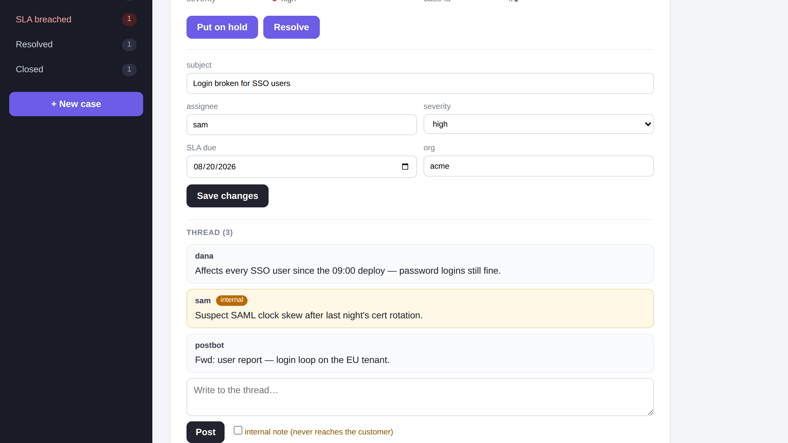
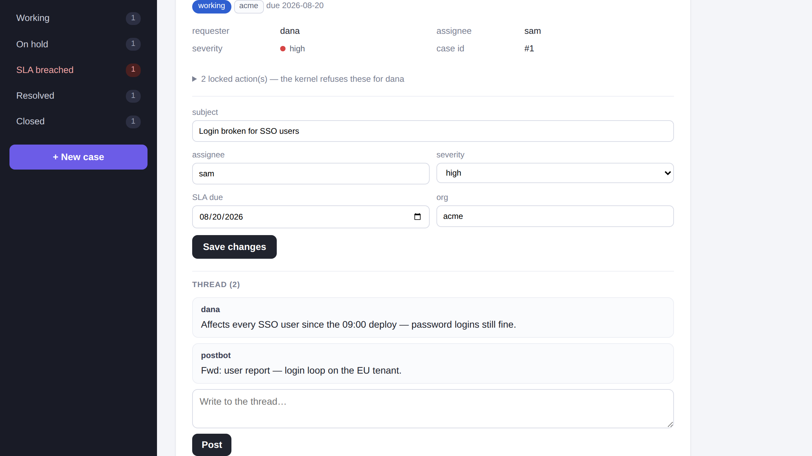
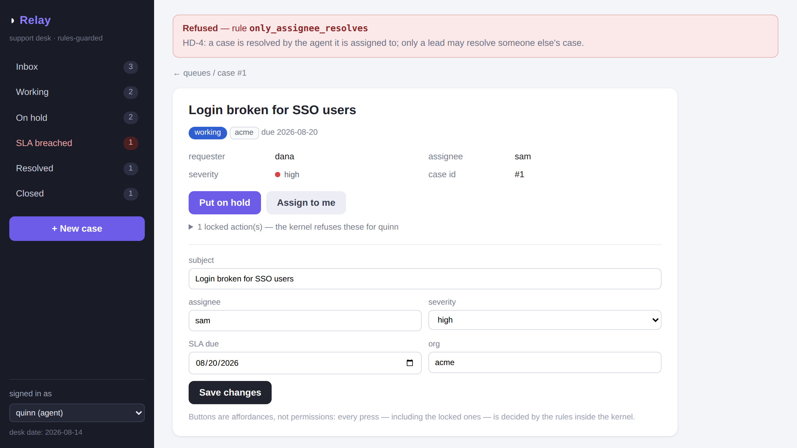

# Formal guardrails — the field manual

*How to build a web SaaS by writing invariants instead of code — with
LLM agents doing the code work, and reasoning engines, not humans,
holding the code to the rules.*

This manual teaches one method with three layers. Each layer is
independently useful; the method is what they compose into. Everything
in here runs: the worked example of Part 1 is `examples/approvals/`
(one command: `./check.sh`), every transcript is real output, and every
mechanism is the one the repository's five services run on today.

**Who this is for.** An experienced developer who has never worked this
way. You know web apps, SQL, CI, code review. You do not need to know
SMT solvers, model checkers, or temporal logic — the method's core move
is that *you never operate those directly*; you write things they can
check, and read what they answer.

---

## Part 0 — Orientation

### 0.1 The inversion

The way you work today: intent lives in tickets and heads; code is the
durable artifact; humans review diffs to keep the two aligned. Every
piece of that inverts:

| | Today | This method |
|---|---|---|
| Durable artifact | the code | **the spec** (rules + gate) |
| Who writes code | you | LLM agents, freely |
| Who reviews code | humans, diff by diff | **nobody** — engines check it |
| What humans review | code | the spec, sentence by sentence |
| What a bug becomes | a regression test | **a frozen gate item** — a counterexample the gate refuses forever |
| Cost of regenerating code | prohibitive | cheap by design |

The one-line contract: **you state what must never and must always
happen; agents make something that does it; reasoning engines — not
you — hold the code to the statement.**

### 0.2 Three layers, one method

Different failure modes need different engines. The method has three
layers because a wrong authorization decision, a race between a
migration and a request, and a lazy agent "fix" that quietly deletes a
feature are three different animals:

```
 LAYER 1  Rules are the program            engine: SMT (Z3), exhaustive
          every single-request decision —  over the WHOLE situation space
          authz, tenancy, lifecycle,
          visibility, document discipline

 LAYER 2  Models before code               engine: model checker (Quint/
          everything that only goes wrong  Apalache/TLC), traces over
          across time and interleavings —  interleavings; conformance
          migrations, jobs, retries        harness against the real system

 LAYER 3  The frozen gate + agent loop     engine: the gate itself —
          all code agents write (UI, glue, frozen invariants + feature
          engine growth, repairs)          runs; counterexamples as the
                                           repair signal
```

Layer 1 is where you live day to day: features arrive as tickets and
become rules. Layer 2 is episodic: you reach for it when a design has
concurrency in it. Layer 3 is the meta-layer: it is *how any code gets
written at all* in this method, including the code of layers 1 and 2's
own applications.

The composition rules — which layer owns which concern, and how the
layers hold each other — are Part 4, and they are the part that makes
this a method rather than three tools.

### 0.3 The numbers up front

You should know what you are buying before reading 1,500 lines. From
this repository's five services, all running on one generic engine:

- **Velocity**: a complete multi-tenant kanban SaaS was 7 tickets → 18
  rules → ~150 lines of YAML, zero application-specific imperative
  code. The analyzer round-trip is ~0.2 s — you re-verify the whole
  application logic more cheaply than running one integration test.
- **Safety**: every service's full decision space is checked
  exhaustively against an independent Z3 encoding — 111,312 situations
  across the five services — plus universal safety properties, witness
  properties, and frozen end-to-end features. Four analyzer rounds on
  the kanban app caught two real authorization holes before any code
  ran.
- **DX**: the honest cost is discipline, not tooling pain: vocabulary
  is a budget you spend consciously, some refusals surface generically
  (`default_deny`) unless you name them, and anything the vocabulary
  can't say must go to a different layer *by decision, not by accident*.

The rest of the manual earns these numbers.

---

## Part 1 — Layer 1: the rule base is the program

### 1.1 The mental shift

You stop writing `if` statements about who may do what. There is no
authorization middleware, no `can_edit?` helper, no scattering of
`WHERE org_id = ?`. Instead there is **one YAML file of rules** that IS
the application's interaction logic, executed by a generic engine that
has never heard of your domain, and analyzed — every time it changes —
by a solver that answers questions no test suite can: *is any rule
dead? does the safety property hold in EVERY reachable situation? is
the happy path still possible at all?*

Three facts make this work:

1. **The decision is total.** Every (actor, action, resource) pair gets
   a decision from the same function. Deny rules override allow rules;
   **silence means deny**. There is no code path that forgets to check.
2. **The vocabulary is finite.** Rules speak only in enumerated facts —
   role, action, state, a handful of booleans. That is what makes
   exhaustive checking affordable, and it is a feature, not a limit:
   you choose the facts (a *budget*, see 1.3).
3. **One vocabulary end to end.** The ticket, the rule, the gate
   property, the runtime 403 and the analyzer counterexample all use
   the same names. When production refuses something, the response body
   names the rule; the rule names the ticket.

### 1.2 Tickets first

The worked example: **Clearance**, an expense-claims service
(`examples/approvals/`). You start where you always start — product
English. Five tickets, verbatim from `TICKETS.md`:

- **EX-1 Organizations** — employees and managers act only inside their
  own org; finance is central.
- **EX-2 Receipts** — a claim cannot be *submitted* without a receipt.
- **EX-3 Four eyes** — managers decide claims; managers file expenses
  too; **nobody ever decides their own claim**.
- **EX-4 Money** — only finance pays; finance does nothing else; a paid
  claim is a frozen record.
- **EX-5 The loop, and leavers** — rejection is revise-and-resubmit;
  after submission everything is the record; deactivated accounts do
  nothing.

Notice what these already are: quantified statements ("nobody ever…",
"only finance…", "nothing… ever changes"). Product owners speak in
∀ and ∃ natively. The method's bet is that you can keep those
quantifiers all the way down.

### 1.3 The vocabulary is a budget

Before rules, you declare what rules may talk about
(`rulesets/approvals/rules.yaml`):

```yaml
entity: claim

roles: [anonymous, employee, manager, finance]

states: [draft, submitted, approved, rejected, paid]

# The situation space is a budget: every boolean doubles it. Only
# `receipt` needs a has_ boolean (EX-2); org feeds a projection and
# amount is data no rule mentions — both opt out.
fields:
  - receipt
  - {name: org, has: false}
  - {name: amount, has: false}

actor_fields: [org]

projections:
  - {name: same_org, kind: actor_matches_field, actor_attr: org, field: org}

lifecycle:
  transitions:
    - {action: create,  from: none,      to: draft}
    - {action: submit,  from: draft,     to: submitted}
    - {action: approve, from: submitted, to: approved}
    - {action: reject,  from: submitted, to: rejected}
    - {action: revise,  from: rejected,  to: draft}
    - {action: pay,     from: approved,  to: paid}
```

Read this as a type declaration for the whole application:

- **The situation.** The engine derives a finite *situation space*:
  `actor.role × actor.active × actor.is_author × action ×
  resource.state × has_receipt × same_org`. For Clearance that is
  3,456 situations — small enough that "check them all" is a trivial
  instruction to a solver, and every claim below is over ALL of them.
- **`fields` and the `has_` opt-out.** A declared field gets an
  automatic `resource.has_<field>` boolean *unless you opt out*. Opt
  out aggressively: `amount` is data the rules never mention, so it
  costs nothing; `receipt`'s emptiness is EX-2, so it pays rent.
  Every boolean you admit doubles the space the solver sweeps and —
  more importantly — doubles what a reviewer must think about.
- **Projections** turn relations into booleans *at the boundary*. Rules
  never see "the actor's org string equals the resource's org field";
  they see `resource.same_org`. The engine computes the projection from
  the live rows; the rules stay propositional. This is the designed
  answer to "but my policy depends on data": you distill the dependency
  into a named boolean, once, and the name becomes part of the
  vocabulary budget.
- **The lifecycle is structural.** Transitions are not rules — an
  action fired from the wrong state is *illegal* (a shape error, HTTP
  409), before any rule runs. Rules answer "may they?"; the lifecycle
  answers "is that even a thing?". Keeping the two apart keeps rules
  short and keeps the state machine analyzable on its own.

There are also **assumptions** — facts about the world the solver may
rely on, which would otherwise generate false counterexamples:

```yaml
assumptions:
  - id: a_authors_file
    description: "Claims are authored by the people who may file them:
      employees and managers (EX-3)."
    holds: 'implies(actor.is_author, actor.role in ["employee", "manager"])'
```

Assumptions are dangerous exactly once: when they silently go stale
(you later allow a new role to create). The analyzer closes that hole
mechanically — it checks that every role that can `create` is an
assumable author, and fails otherwise.

### 1.4 Rules: deny, allow, and silence

The rules themselves — all ten, this is the entire application logic:

```yaml
rules:
  # ---- denies ----
  - id: deny_inactive
    description: "EX-5: a deactivated account can do nothing at all."
    effect: deny
    when: 'not actor.active'

  - id: org_walls
    description: "EX-1: employees and managers act only inside their own
      organization — reading included, and a claim can never be filed
      into another org."
    effect: deny
    when: 'actor.role in ["employee", "manager"] and not resource.same_org'

  - id: receipt_required
    description: "EX-2: no receipt, no submission."
    effect: deny
    when: 'action == "submit" and not resource.has_receipt'

  - id: no_self_decision
    description: "EX-3: nobody decides their own claim — managers file
      expenses too, and someone else approves them."
    effect: deny
    when: 'action in ["approve", "reject"] and actor.is_author'

  - id: the_record_is_sealed
    description: "EX-4 + EX-5: drafts are the only thing you edit or
      delete; everything after submission is the record."
    effect: deny
    when: 'resource.state != "draft" and action in ["edit", "delete"]'

  # ---- allows ----
  - id: staff_file
    effect: allow
    when: 'actor.role in ["employee", "manager"] and action == "create"'

  - id: author_maintains
    effect: allow
    when: 'actor.is_author
           and action in ["read", "edit", "delete", "submit"]'

  - id: author_revises
    effect: allow
    when: 'actor.is_author and action == "revise"'

  - id: manager_reviews
    effect: allow
    when: 'actor.role == "manager"
           and action in ["read", "approve", "reject"]'

  - id: finance_pays
    effect: allow
    when: 'actor.role == "finance" and action in ["read", "pay"]'
```

The semantics you must internalize:

- **Deny overrides allow.** `author_maintains` grants `edit` broadly;
  `the_record_is_sealed` carves the seal out of it. Order between
  denies matters only for *which name* surfaces in the refusal.
- **Silence denies.** No rule mentions `anonymous`. No rule says
  "employees never approve". No rule says "nothing touches a paid
  claim". All three are true anyway — `default_deny` — and the gate
  will *prove* them (1.6).
- **Every rule is a stakeholder sentence.** `description` is not a
  comment; it is what the product owner reviews, and it names its
  ticket. Reviewing the spec means reading these sentences against the
  solver's findings — never reading agent diffs.

### 1.5 The two disciplines (when to write a deny, when not to)

This is the craft heart of Layer 1, learned across five services:

**Role containment: tight allows, no deny, prove it with the gate.**
"Employees never approve", "finance only reads and pays", "the public
sees nothing" — do NOT write these as denies. The tight allows above
already make them true, so a deny would be *provably dead* — the
analyzer will fail it as noise (see 1.9 — this is not hypothetical;
it is stage 2 of Clearance's own check). Instead you pin each
containment with a universal gate property (S1, S4, S10 below), which
holds forever regardless of how the allows evolve.

**State seals: broad allow + carving deny.** For "nothing edits the
record after submission" you *could* scope `author_maintains` down to
drafts and let silence deny the rest. Deliberately don't: write the
broad allow and the explicit `the_record_is_sealed` deny. The deny is
live (the analyzer proves it changes decisions), and — decisive for
UX — **the refusal has a name**. When a user hits it, the 403 carries
`the_record_is_sealed` and its stakeholder sentence, not a generic
`default_deny`. Named denies are error messages you can ship.

The trade is exactly that: containments-by-silence surface as
`default_deny` (acceptable for actions no legitimate user ever tries —
finance clicking "approve" has no UI affordance to begin with); seals
on the hot path deserve names.

### 1.6 The gate, directions 1 and 2 (`safety.yaml`)

The rules say what the system does. The gate says what must be true of
it — deliberately redundant, the way double-entry bookkeeping is
redundant. Direction 1: universal safety, quantified over EVERY
situation the rules allow:

```yaml
safety:
  - id: S4_only_managers_decide
    description: "EX-3: approve and reject belong to managers only."
    requires: 'implies(action in ["approve", "reject"],
                       actor.role == "manager")'

  - id: S7_paid_is_forever
    description: "EX-4: a paid claim admits nothing but reading."
    requires: 'implies(resource.state == "paid", action == "read")'

  - id: S10_finance_contained
    description: "EX-4: finance reads and pays — the blast radius of a
      compromised finance account."
    requires: 'implies(actor.role == "finance", action in ["read", "pay"])'
```

Read `S10` again: it is a *security posture statement* — "here is the
worst a stolen finance credential can do" — proved, not hoped. Note
also `S7`: there is no rule about paid claims at all; immutability
falls out of tight allows plus the lifecycle, and S7 pins it so no
future rule can unpin it silently.

Direction 2: possibility. **A gate with only safety properties is a
trap** — the safest system does nothing, and an agent (or a hasty
colleague) under safety-only pressure will happily "fix" a violation
by deleting the feature. Every gate must also state what must remain
possible:

```yaml
possibility:
  - id: P2_claims_can_get_paid
    description: "EX-4: the flow can actually finish — someone can pay."
    witness: 'action == "pay"'

  - id: P3_managers_expense_too
    description: "EX-3: a manager can submit their own claim — the
      four-eyes story is not vacuous."
    witness: 'actor.is_author and actor.role == "manager"
              and action == "submit"'
```

And structural jurisdiction over the lifecycle itself — "no future
feature may add a shortcut into `paid`":

```yaml
lifecycle:
  only_into:
    paid: [pay]
    approved: [approve]
```

### 1.7 The gate, direction 3 (`features.yaml`)

Frozen end-to-end scenarios, replayed on every change — first against
the pure decision engine in CI, then over real HTTP. The crucial
convention: **refusals are expected BY NAME.** A feature step that
expects `denied_by: receipt_required` fails if the submission is
allowed *and* fails if it is denied by anything else — so a deleted
deny cannot hide behind another deny that happens to overlap.

```yaml
features:
  - id: feat_four_eyes
    steps:
      - {actor: mia, action: create,
         set: {org: acme, amount: "412.00", receipt: "hotel.pdf"},
         expect: allow, state_after: draft}
      - {actor: mia, action: submit, expect: allow, state_after: submitted}
      - {actor: mia, action: approve, expect: deny,
         denied_by: no_self_decision}
      - {actor: fern, action: approve, expect: deny,
         denied_by: default_deny}
      - {actor: mo, action: approve, expect: allow, state_after: approved}
      - {actor: mia, action: pay, expect: deny, denied_by: default_deny}
      - {actor: fern, action: pay, expect: allow, state_after: paid}
```

Features are where liveness gets *concrete*: S-properties say paying is
finance's alone; `feat_four_eyes` proves a real claim actually reaches
`paid` through real actors. Safety, possibility, features — three
mutually redundant directions, and the redundancy is the point.

### 1.8 Run it

```bash
cd examples/approvals && ./check.sh
```

Stage 1, the analyzer, real output:

```text
== rule-base analysis: .../approvals/rules.yaml ==
rules: 10 (5 deny, 5 allow) | roles: 4 | entities: 1 | situation space: 3456
-- dead rules (does each rule ever change a decision?) --
   ok: all 10 rules are effectual (each changes at least one decision)
-- assumptions: every role that can create must be an assumable author --
   ok: creating roles ['employee', 'manager'] are all assumable authors
-- safety: must hold in EVERY allowed situation --
   ok   S1_no_anonymous
   ...
   ok   S10_finance_contained
-- possibility: must hold in SOME allowed situation --
   ok   P3_managers_expense_too  witness: {role: manager, action: submit,
        state: draft, active: true, is_author: true, has_receipt: true,
        same_org: true} (by author_maintains)
   ...
-- lifecycle: every state reachable, every transition usable --
   ok: 6 transitions live, all 5 states reachable, gated entries respected
-- feature runs (pure decision engine, frozen scenarios) --
   ok   feat_expense_flow (12 steps)
   ok   feat_four_eyes (7 steps)
   ok   feat_rejection_loop (10 steps)
VERDICT: PASS (0 findings)
```

Learn to read the possibility lines: each `ok` carries a **witness** —
a concrete situation the solver found, with the granting rule named.
`P3`'s witness is a manager, author of their own draft, with a receipt,
submitting — granted by `author_maintains`. Witnesses are how you spot
"passes for the wrong reason" at a glance.

This run costs a fraction of a second. You will run it the way you run
a type checker.

### 1.9 What failure looks like (and why you preserve it)

Clearance's real first draft had employees-only filing. Its remains are
preserved in `rulesets/approvals-round1/`, and `check.sh` stage 2
*requires* it to keep failing against the frozen gate:

```text
-- dead rules (does each rule ever change a decision?) --
   FAIL DEAD deny rule 'no_self_decision': it never refuses anything
        that another rule would have allowed
-- safety: must hold in EVERY allowed situation --
   ok   S5_no_self_decision
   ...
-- possibility: must hold in SOME allowed situation --
   FAIL P3_managers_expense_too: IMPOSSIBLE — no allow rule ever grants it
-- feature runs --
   FAIL feat_four_eyes: step 1 (mia create): expected allow, got deny
        (rule: default_deny)
VERDICT: FAIL (3 finding(s))
```

Study this transcript; it teaches three permanent lessons.

1. **S5 still passes.** "Nobody decides their own claim" holds
   *vacuously* in the buggy draft — nobody can author-and-decide
   because managers can't author at all. A safety-only gate would have
   said the four-eyes ticket was fully satisfied. Only the possibility
   direction (`P3 IMPOSSIBLE`) and the dead-rule check expose that the
   feature does not exist. **Gates need both directions** — this is
   the single most transferable lesson in the manual.
2. **The dead-rule check is a spec review.** A dead deny is not
   harmless clutter; it is the solver telling you "this sentence of
   your spec is not doing anything" — which either means the sentence
   is redundant (delete it) or, as here, the world it guards against
   is unreachable *and that unreachability is itself the bug*.
3. **Findings are the currency.** Nothing here is a stack trace. Every
   failure names a rule, a property, or a step, in the vocabulary of
   the tickets. This is what the product owner reviews. It is also,
   verbatim, the repair signal an agent gets in Layer 3.

The bug's fix was a *requirement* fix (managers expense too — new allow
`staff_file`, updated assumption, new witness P3), and the broken draft
became a permanent regression: the gate that caught it must keep
catching it, forever, in CI. **Every counterexample becomes a frozen
gate item** — you will meet this ratchet again in every layer.

### 1.10 Serving it: the kernel and the free UI

The rule base decides; something must enforce. That something is a
**kernel** — a small, generic, class/function-level API that is the
*only* thing application code may import. From the kernel's own
docstring (`engine/kernel.py`):

```python
from engine import kernel

k = kernel.boot("rulesets/approvals", "app.db", today="2026-08-15")
rows = k.visible(actor)                      # the read rule, applied
row  = k.create(actor, {"org": "acme", "receipt": "taxi.pdf"})
row  = k.act(actor, "submit", row["id"])     # lifecycle transition
d    = k.decide(actor, "approve", row)       # pure query, for affordances
try:
    k.delete(actor, row["id"])
except kernel.Denied as e:
    e.rule.id                                # 'the_record_is_sealed'
```

The load-bearing properties:

- **Every read and every mutation is decided before the store is
  touched.** `visible()` *is* the read rule — there is no separate
  "list" logic to keep consistent with it. This closes the classic
  IDOR-by-enumeration hole by construction.
- **Refusals are typed values.** `Denied.rule` carries the rule — id
  and stakeholder sentence — so the HTTP layer's 403 body and toast
  are one line of rendering, in gate vocabulary.
- **Edits are decided twice**: on the current row ("may this actor edit
  this thing?") and on the post-edit row ("may it become this?"). A
  customer re-tenanting a resource by editing its `org` field is
  refused by the same `org_walls` that guards reads. If your framework
  decides edits once, it has this hole.
- **The UI above the kernel is FREE.** Hand-written htmx, React,
  anything — styled and reshaped without limit, because it *cannot*
  weaken policy: hiding a button changes nothing about what the kernel
  permits, and a forged request for a hidden button gets the same named
  403. The UI renders affordances by *asking* (`k.decide(...)` /
  `k.affordances(...)` probes) rather than by re-deriving policy — the
  moment UI code computes policy, it is an enforcement point, and
  enforcement points are exactly what you have one of.
- **The boundary is mechanical, not conventional.** A lint
  (`python -m analysis.boundary <app dir>`) verifies app code imports
  `engine.kernel` and nothing beneath it, and each service's CI keeps a
  three-line bypass variant that the lint is *required to fail*. A
  boundary nobody can violate quietly is worth ten style guides.

See it at scale in `examples/helpdesk/` (Relay): a ~700-line
hand-written htmx UI — cross-state SLA queues, assign-to-me, threads
with internal notes — with zero policy in it, over exactly this kernel.
The same case, two viewers — staff see THREAD (3) with an internal
note; the customer sees THREAD (2), and the note does not exist for
her even by forged id, because `visible()` is the read rule:

| staff view | customer view |
|---|---|
|  |  |

And a refusal on the wire — the 403 toast naming its rule, straight
from `Denied.rule`:



### 1.11 Relations: child entities and parent context

Real products are not one entity. A comment's legality depends on its
*case*: a closed case takes no new comments; the org wall extends to
the thread. The wrong answer is N rule bases plus client-side joins —
whoever computes cross-entity context IS an enforcement point, and the
UI must never be one. The engine answer (`children:` + `context:`,
from Relay's rule base):

```yaml
children:
  - entity: comment
    states: [posted, redacted]
    fields: [body, internal]
    context: [state, same_org]     # imports parent.state, parent.same_org
    lifecycle:
      transitions:
        - {action: post,   from: none,   to: posted}
        - {action: redact, from: posted, to: redacted}
```

Child rules then speak about the parent — and the kernel joins the
live parent row into every child decision (create, read, edit, list),
so the context is always current:

```yaml
  - id: sealed_thread
    description: "A closed case seals its thread and its evidence."
    entity: [comment, attachment]
    effect: deny
    when: 'parent.state == "closed" and action != "read"'
```

```python
k.create(actor, {"body": "hi"}, entity="comment", parent_id=case["id"])
k.visible(actor, entity="comment", parent_id=case["id"])   # the thread
```

Two sharp edges, both learned the hard way and both now pinned by
gates — respect them in your own rule bases:

- **Untagged rules apply to the ROOT entity only.** That defaults
  correctly for allows (fails closed) but is a trap for global denies:
  an actor-only deny like `deny_inactive` silently stops covering
  comments the day you add them — it **fails open**. Tag it
  (`entity: [case, comment, attachment]`) and pin it with per-entity
  gate properties, so untagging is a named finding, not a quiet hole.
- **Parent-delete cascades do not consult child delete rules.** A
  child's immortality is only as strong as its parent's. If children
  must be forever, the *parent* must be undeletable.

And one honest limit: rules can see the parent's state, never
aggregates over children ("close only if no open comments" is a frame
problem, not a missing feature — see `research/16-multi-entity-rules.md`,
falsifier ME-1, for the conservative cut if you need it).

### 1.12 Day 2: the working loop

A new ticket arrives. The loop, which you will run in minutes, not
days:

1. **Write the ticket into `TICKETS.md`** in product English with its
   quantifiers intact.
2. **Spend vocabulary consciously.** New state? New projection? A
   `has_` boolean? Each admission is permanent review surface — prefer
   reusing existing facts; opt fields out of `has_` by default.
3. **Write the rules** — carving denies for hot-path seals (named
   403s), tight allows for containment.
4. **Extend the gate first or alongside, never after**: an S-property
   for each "never/always/only", a witness for each "can", feature
   steps for the scenario *including its expected refusals by name*.
5. **Run the analyzer.** Read every witness (not just the verdict
   line). A dead rule or an IMPOSSIBLE witness at this stage is the
   solver reviewing your spec — argue with it before any code exists.
6. **Ship.** No enforcement code to write — the kernel already enforces
   the new rules. UI affordances appear via the probe pattern. If the
   UX needs new surfaces, that is free-layer work (agent work, Layer 3).
7. **Freeze.** The new gate items never leave. Weakening the gate is a
   human-only, explicit act with a written reason.

### 1.13 What this layer refuses to do

Knowing the boundary is part of the skill. Not in the vocabulary, by
design: arithmetic and cross-row aggregates (sum of claims this month),
fuzzy matching, free-text inspection, field-level *visibility* (a
redacted comment's body is hidden by UI choice — the kernel guards the
row, not the column; see falsifier ME-3), true temporal ordering
("approved within 48h"). Some of these go to projections (a boolean
distilled at the boundary, like `sla_breached` from a date), some to
Layer 2 (ordering, concurrency), some stay deliberately client-side.
The decision that matters: **each exclusion is explicit and recorded**,
never discovered in production.

### 1.14 The ledger

**DX** — the program you review is ~150 lines of YAML sentences; the
solver reviews with you; refusal UX is free (named 403s). The costs:
vocabulary discipline is real work, and thinking in
allowed-situations-space takes about a week to become native.
**Velocity** — a ticket is usually a handful of rules plus gate lines;
analyzer feedback in 0.2 s; no enforcement code, ever. **Safety** —
exhaustive, not sampled: every property over every situation, both
directions frozen, boundary lint in CI, forged requests hit the same
kernel the buttons do.

---

## Part 2 — Layer 2: models before code

<!-- TO FILL: P1/P3 brief — bugs between requests; worked Quint model
(migration under snapshot isolation); the two falsified designs;
escalation ladder; conformance harness; tests as approximation;
ledger. -->

---

## Part 3 — Layer 3: the frozen gate and the agent loop

<!-- TO FILL: P4 brief — never review agent diffs; mechanical freeze;
loop driver; counterexamples as repair signal; episode 1 vs 2 (gate
strength beats prompting); safety-only gate liveness gap; capability
tokens; ledger. -->

---

## Part 4 — Composition: one method

### 4.1 Which layer owns which concern

The routing decision you make on every requirement:

| The requirement sounds like… | It lives in… | Because |
|---|---|---|
| "Only X may…", "never…", "X sees only…" (one request decides it) | **Layer 1** rules + S-property | exhaustive proof is cheap here |
| "…must have a Y before…", "after Z it is frozen" | **Layer 1** deny + lifecycle + `only_into` | state discipline is rule territory |
| "…even while the migration runs", "two requests at once", "the job retries" | **Layer 2** model, then conformance | only interleavings expose it |
| "eventually", "within/by <time>", ordering across requests | **Layer 2** (temporal props under fairness) | Layer 1 sees one situation at a time |
| "the UI should…", "make it feel…" | **free layer**, agent-built under the **Layer 3** gate | no policy content |
| "sum/count of…", fuzzy matching, ranking | projection at the boundary, or deliberately client-side — *recorded* | outside the finite vocabulary |

Two composition invariants sit under the table. **Anything that guards
must sit below the seam it guards** (context joins in the kernel, not
the client; money truth from the bank feed, not the UI). **Anything
excluded is excluded by written decision** — the falsifier lists in
`research/` are that record.

### 4.2 One vocabulary, end to end

The same identifier — `no_self_decision`, `sealed_thread`,
`org_walls` — appears in the ticket, the rule, the S-property, the
feature step's `denied_by:`, the analyzer finding, the kernel's
`Denied.rule.id`, the HTTP 403 body, and the UI toast. This is not
cosmetic. It is what makes the system *debuggable across layers*: a
support engineer pastes a 403 name and lands on the product sentence
and the proof that guards it; an agent's counterexample names the same
atom the product owner approved. Guard the vocabulary the way you
guard the gate: one name per concept, no synonyms, no renames without
a migration of every artifact.

### 4.3 Every seam has a mechanical check

The method's honesty lives at its seams — each one held by a machine,
never by convention:

| Seam | Held by |
|---|---|
| rules ↔ runtime | exhaustive two-backend agreement (runtime eval vs Z3, all situations) |
| kernel ↔ UI | boundary lint in CI + a preserved bypass variant that must FAIL |
| model ↔ code | conformance harness driving the real system (Layer 2) |
| spec ↔ agents | the frozen region diffed and reverted mechanically (Layer 3) |
| NL ticket ↔ formal rule | the one unsound seam — held by grounded human review + the gate's redundancy (see 4.6) |

When you extend the method, this is the design question to ask first:
*what mechanically holds the new seam?* If the answer is "discipline",
the seam is already leaking.

### 4.4 A ticket that crosses all three layers

<!-- TO FILL after briefs: worked composite — e.g. "org column split
migration while the desk serves traffic": L1 tenancy rules unchanged &
proven; L2 expand/contract model + conformance; L3 agent implements
backfill under the frozen gate. Show the artifacts touched per layer
and the counterexample flow between them. -->

### 4.5 Incidents: the ratchet

A production bug in this method has a fixed afterlife: reproduce it as
a counterexample *in gate vocabulary* (a feature step with a
`denied_by`, an S-property, a model trace, a conformance divergence);
add it to the frozen gate; only then repair — usually by pointing an
agent at the failing gate. The gate only ever tightens. Clearance's
round-1 draft failing forever in stage 2, Flowdeck's round-2 draft
pinned in its check, the no-drain anomaly reproduced as a negative test
in the conformance harness — same ratchet, three layers.

### 4.6 What stays human

The method removes diff review, not judgment. Humans still own: the
**tickets** (what should be true); **spec review** — reading rules and
gate sentences against ticket English, sentence by sentence, because
NL→formal translation is the one unsound step and the solver cannot
know what you *meant*; **vocabulary admission** (every new fact is an
ontology commitment); **gate weakening** (agents may propose, never
apply); and **the layer-routing calls** of 4.1. Notice these are all
spec-side acts. That is the job now: you are the author and reviewer
of *meaning*; the machines own *conformance*.

### 4.7 Starting tomorrow (adoption path)

You do not adopt three layers in one quarter. The order that works:

1. **Gate an existing service's riskiest surface** (authz) with Layer
   1: extract the decision into a rule base, run the analyzer, keep
   your existing code as the enforcement point *temporarily*, checked
   by two-backend agreement.
2. **Move enforcement into the kernel** service by service; add the
   boundary lint; let the UI go free.
3. **Introduce the Layer 3 gate on one repo** — freeze the rule base +
   gate files, let an agent take tickets, review only findings.
4. **Reach for Layer 2 the first time a design has a migration or a
   job in it** — one model, one falsified design, and the team will
   not need convincing again.

---

## Part 5 — Honest costs, limits, and when not to use this

<!-- TO FILL: consolidated frictions from DEVLOGs + falsifier index +
scoreboard numbers; when NOT to use (tiny CRUD with one role? hard
real-time? ML-shaped logic?); open problems (aggregates/ME-1,
field-level visibility/ME-3, N+1 joins/ME-4). -->

---

## Appendix A — Commands

```bash
# the analyzer (the type-checker of this method) — from the engine dir:
python -m analysis.analyze <ruleset-dir>              # gate of that dir
python -m analysis.analyze <draft-dir> --gate <frozen-ruleset-dir>
python -m analysis.boundary <app-dir>                 # kernel-only imports
python live_demo.py <ruleset-dir>                     # features over HTTP

# one-command entries, per service:
examples/approvals/check.sh     # the manual's worked example
examples/taskboard/check.sh     # Flowdeck (kanban SaaS)
examples/helpdesk/check.sh      # Relay (multi-entity, free htmx UI)
examples/rule-driven-cms/check.sh
prototypes/p1-migration-model/check.sh
prototypes/p2-invariant-oracle/demo.sh
prototypes/p3-conformance-harness/run_demo.sh
```

## Appendix B — File layout of a Layer-1 service

```
examples/<service>/
  TICKETS.md                      # product English, quantifiers intact
  rulesets/<service>/
    rules.yaml                    # THE PROGRAM: vocabulary + rules
    safety.yaml                   # FROZEN gate: S-props, witnesses, only_into
    features.yaml                 # FROZEN gate: scenarios, denials by name
  rulesets/<service>-round1/      # preserved buggy drafts the gate must fail
  app.py                          # FREE layer: hand-written UI, kernel-only
  tests/                          # incl. exhaustive two-backend agreement
  check.sh                        # one command: gate, negatives, HTTP replay
  DEVLOG.md                       # predictions, findings, honest frictions
```

## Appendix C — Glossary

- **situation** — one point of the finite decision space: (role,
  active, is_author, action, state, has_*, projections, parent.*).
- **projection** — a named boolean distilled from live data at the
  boundary (`same_org`), so rules stay propositional.
- **gate** — the frozen acceptance surface: safety ∀ + possibility ∃ +
  lifecycle jurisdiction + feature runs. Both directions, always.
- **witness** — a concrete situation proving an ∃-property, with the
  granting rule named.
- **dead rule** — a rule that never changes any decision; a finding.
- **containment** — a role's proven blast radius (tight allows +
  S-property, no deny).
- **kernel** — the sole enforcement point; app code imports it and
  nothing beneath it.
- **frozen region** — spec files agents cannot edit; enforced by diff
  + revert, not convention.
- **counterexample** — machine-readable refutation (analyzer finding,
  ITF trace, conformance divergence); the currency all layers trade in.
