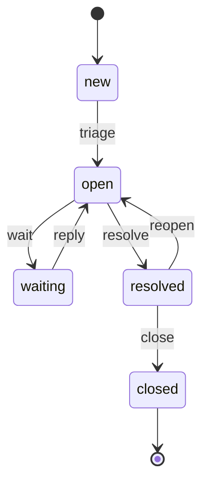
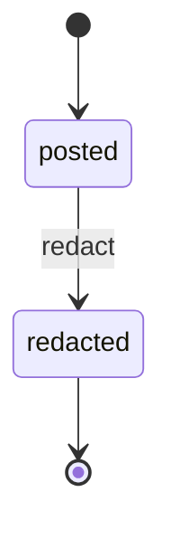
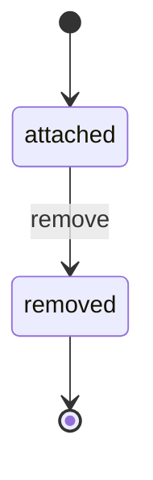

# relay — review surface

Generated by `python -m boxkit digest`. Everything below is REVIEWED code, summarised; generated code (impl/, tests/generated/) is not listed because no human reviews it — the gate does.

## 1. Data model (`model.py`)

- **Actor** — `name: str`, `role: Role`, `org: str | None`, `active: bool`
- **Case** — `id: int`, `subject: str`, `org: str`, `requester: str`, `state: CaseState`, `severity: Severity`, `assignee: str | None`, `sla_due: date | None`
- **Comment** — `id: int`, `case_id: int`, `author: str`, `body: str`, `internal: bool`, `state: CommentState`
- **Attachment** — `id: int`, `case_id: int`, `author: str`, `filename: str`, `state: AttachmentState`
- **Denied** — `rule: str`, `reason: str`
- **CaseDraft** — `subject: str`, `org: str`, `severity: Severity`, `sla_due: date | None`
- **CasePatch** — `subject: str | None`, `org: str | None`, `severity: Severity | None`, `assignee: str | None`, `sla_due: date | None`
- **CommentDraft** — `body: str`, `internal: bool`
- **AttachmentDraft** — `filename: str`
- **Affordance** — `action: str`, `allowed: bool`, `rule: str | None`, `reason: str | None`
- **Role** ∈ {anonymous, customer, agent, lead, mailbot}
- **Severity** ∈ {high, med, low}
- **CaseState** ∈ {new, open, waiting, resolved, closed}
- **CaseAction** ∈ {triage, wait, reply, resolve, reopen, close}
- **CommentState** ∈ {posted, redacted}
- **CommentAction** ∈ {redact}
- **AttachmentState** ∈ {attached, removed}
- **AttachmentAction** ∈ {remove}

## 2. State transitions (`machine.py`)

### case



| action | from | to |
|---|---|---|
| triage | new | open |
| wait | open | waiting |
| reply | waiting | open |
| resolve | open | resolved |
| reopen | resolved | open |
| close | resolved | closed |

### comment



| action | from | to |
|---|---|---|
| redact | posted | redacted |

### attachment



| action | from | to |
|---|---|---|
| remove | attached | removed |

## 3. Guard rules (`machine.py`) — deny wins, silence denies

| rule | effect | entities | description | when |
|---|---|---|---|---|
| `deny_inactive` | deny | case, comment, attachment | A deactivated account can do nothing at all. | `not s.actor.active` |
| `org_walls` | deny | case | HD-1: customers see and touch only their own organization's cases — reading included, and a case can never be moved into or out of an organization by its customers. | `s.actor.role == "customer" and not s.same_org` |
| `case_needs_subject` | deny | case | HD-2: no case without a subject — a subjectless case cannot be triaged, routed or reported on. | `s.action == "open" and not s.case.subject.strip()` |
| `only_assignee_resolves` | deny | case | HD-4: a case is resolved by the agent it is assigned to; only a lead may resolve someone else's case. | `s.action == "resolve" and not s.mine and s.actor.role != "lead"` |
| `breach_needs_lead` | deny | case | HD-5: once the SLA is breached, an ordinary agent may no longer resolve the case — every breach gets senior eyes. | `s.action == "resolve" and s.breached and s.actor.role != "lead"` |
| `sealed_after_resolution` | deny | case | HD-2 + HD-6: a resolved or closed case is no longer editable, by anyone — reopen it (customers) or live with the record. | `s.case.state in ("resolved", "closed") and s.action == "edit"` |
| `org_walls_thread` | deny | comment, attachment | HD-1 via HD-8/9: the org wall extends to a case's thread and evidence — the PARENT case's org decides. | `s.actor.role == "customer" and not s.same_org` |
| `sealed_thread` | deny | comment, attachment | HD-8/9 + HD-6: a closed case seals its thread and its evidence — nothing new is said, redacted, attached or removed; the record stays readable forever. | `s.case.state == "closed" and s.action != "read"` |
| `comment_needs_body` | deny | comment | HD-8: a comment needs a body. | `s.action == "post" and s.comment is not None and not s.comment.body.strip()` |
| `internal_is_staff_only` | deny | comment | HD-8: internal notes never reach customers or the robot — not readable, not postable, not anything. | `s.comment is not None and s.comment.internal and not s.staff` |
| `fresh_evidence_only` | deny | attachment | HD-9: a resolved or closed case takes no new evidence — dispute the resolution first. | `s.action == "attach" and s.case.state in ("resolved", "closed")` |
| `attachment_needs_file` | deny | attachment | HD-9: an attachment needs a filename. | `and not s.attachment.filename.strip())` |
| `customer_opens` | allow | case | HD-2: customers open cases (into their own org). | `s.actor.role == "customer" and s.action == "open"` |
| `customer_follows` | allow | case | HD-1: everyone in the customer org follows the org's cases. | `s.actor.role == "customer" and s.action == "read"` |
| `customer_edits` | allow | case | HD-2: customers maintain their org's cases while they are being worked. | `s.actor.role == "customer" and s.action == "edit"` |
| `customer_replies` | allow | case | HD-3: a customer reply pulls a waiting case back into the working queue. | `s.actor.role == "customer" and s.action == "reply"` |
| `customer_reopens` | allow | case | HD-4: the requester's side decides whether it is fixed — customers reopen resolved cases. | `s.actor.role == "customer" and s.action == "reopen"` |
| `staff_serve` | allow | case | HD-3: staff work every org's cases: read, edit, open (a case taken by phone), triage, put on hold, resolve. | `s.staff and s.action in ("read", "edit", "open", "triage", "wait", "resolve")` |
| `lead_closes` | allow | case | HD-6: closing is the QA step, and it is a lead's. | `s.actor.role == "lead" and s.action == "close"` |
| `mailbot_files` | allow | case | HD-7: the mail robot opens cases from inbound email and files customer replies — its entire blast radius. | `s.actor.role == "mailbot" and s.action in ("open", "reply")` |
| `customer_discusses` | allow | comment | HD-8: customers read and join their org's case threads. | `s.actor.role == "customer" and s.action in ("read", "post")` |
| `staff_discuss` | allow | comment | HD-8: staff read and join every thread, internal notes included. | `s.staff and s.action in ("read", "post")` |
| `lead_redacts` | allow | comment | HD-8: if something must disappear, a lead redacts it — and the redaction stays on the record. | `s.actor.role == "lead" and s.action == "redact"` |
| `mailbot_files_mail` | allow | comment | HD-8: the robot files inbound email bodies as comments — it never reads the thread back. | `s.actor.role == "mailbot" and s.action == "post"` |
| `customer_attaches` | allow | attachment | HD-9: customers read and add their org's evidence. | `s.actor.role == "customer" and s.action in ("read", "attach")` |
| `staff_attach` | allow | attachment | HD-9: staff read and add evidence on every case. | `s.staff and s.action in ("read", "attach")` |
| `author_removes` | allow | attachment | HD-9: a mistaken upload is removed by the person who attached it (removal keeps the tombstone). | `and s.actor.role in ("customer", "agent", "lead"))` |
| `lead_removes` | allow | attachment | HD-9: a lead removes anyone's mistaken upload. | `s.actor.role == "lead" and s.action == "remove"` |
| `mailbot_attaches` | allow | attachment | HD-9: the robot files email attachments — and never removes or reads anything. | `s.actor.role == "mailbot" and s.action == "attach"` |

## 4. Black boxes (`boxes.py`)

### `route` — spec `eca0884928aa8ec6` (fresh)

```python
def route(req: HttpRequest) -> Route
```

Turn one HTTP request into a typed view or command. No decisions
about permission: the kernel makes those when the shell applies it.

GET routes:
  "/"                 -> ShowQueue(query "q" if it is a QueueKey, else "inbox")
  "/new"              -> ShowNewCase()
  "/case/<id>"        -> ShowCase(id)
POST routes (fields come from `form`):
  "/case"             -> OpenCase(CaseDraft(subject, org, severity,
                         sla_due)); severity must be high/med/low
                         (default "med"); sla_due is an ISO date or
                         empty (None)
  "/case/<id>/act"    -> MoveCase(id, form "action"); the action must
                         be a CaseAction
  "/case/<id>/edit"   -> EditCase(id, CasePatch(...)); only fields
                         present in the form are set; an empty sla_due
                         means "unchanged"; an empty assignee is kept
                         as "" (it unassigns)
  "/case/<id>/comment"-> PostComment(id, CommentDraft(body,
                         internal = form "internal" == "yes"))
  "/case/<id>/attach" -> AttachFile(id, AttachmentDraft(filename))
  "/comment/<cid>/redact"    with form "case" -> RedactComment(case, cid)
  "/attachment/<aid>/remove" with form "case" -> RemoveAttachment(case, aid)
  "/persona"          -> SwitchPersona(form "persona", "" if absent)
Ids are positive decimal integers; a path whose id is not one matches
no route. A malformed FORM field (bad date, unknown severity or action,
a missing or non-numeric "case" field) yields Invalid(message naming
the field, back = the page the form came from: ShowCase for
"/case/<id>/..." forms, ShowNewCase for "/case", ShowQueue("inbox")
otherwise). Anything else -> NotFound(). Text fields are passed
through as typed (the kernel trims and validates them).

### `sort_into_queues` — spec `5e72a58e6ccdcb85` (fresh)

```python
def sort_into_queues(cases: list[Case], today: date) -> list[Queue]
```

Partition the cases a viewer can see into the desk's six queues, in
this order and with these labels: inbox "Inbox" (state new), working
"Working" (open), waiting "On hold" (waiting), breached "SLA breached",
resolved "Resolved", closed "Closed". "SLA breached" is a cross-state
view: every case in new/open/waiting whose sla_due is before `today`
(such a case is ALSO in its state queue). Within a queue, cases are
ordered by severity (high, med, low), then by id ascending. Every queue
is returned, empty or not.

### `sidebar` — spec `363d56fe0035c8a5` (fresh)

```python
def sidebar(current: QueueKey | None, oob: bool, desk: DeskReader, sort: QueueSorter, esc: Escape) -> str
```

The left navigation as one `<aside id="sidebar">` element (add
`hx-swap-oob="true"` when `oob`). Contents: the "Relay" brand; one link
per queue from `sort(desk.cases(), desk.today())` with its case count,
`hx-get="/?q=<key>"` targeting `#content` and pushing the URL, the
`current` one highlighted and the breached one styled as an alert; a
"+ New case" button (`hx-get="/new"`); and a persona switcher: a form
POSTing to "/persona" with a <select name="persona"> listing
desk.people() as "name (role · org)" plus an "anonymous" option with
value "", the current viewer (desk.me()) selected, submitting on
change. Shows the desk date. All text passes through `esc`.

### `queue_page` — spec `8fcd004f2ae32df4` (fresh)

```python
def queue_page(queue: QueueKey, notice: Notice | None, desk: DeskReader, sort: QueueSorter, esc: Escape) -> str
```

The main-column HTML for one queue, as `desk.me()` sees it: the
notice (if any) as a toast — a refusal shows "Refused — rule <rule>"
with its text; then the queue's label as heading, a count line, and a
table (severity, subject, org, state, assignee, SLA) of the queue's
cases in the order `sort` returns them. Each row opens its case
(`hx-get="/case/<id>"` into `#content`, pushing the URL). SLA cells
show the due date; for cases in new/open/waiting past due, show it in
alert style with "N d over". An empty queue says so plainly. All
user-provided text passes through `esc`.

### `case_page` — spec `a460f8a937830c08` (fresh)

```python
def case_page(case_id: int, notice: Notice | None, desk: DeskReader, esc: Escape) -> str
```

The main-column HTML for one case the viewer can read
(`desk.case(case_id)` returns a Case; if not, render a short "not
available" message). Shows: a "← queues" link; the notice toast; the
subject, state pill, org, SLA; requester, assignee, severity.

Actions: for each allowed `desk.case_actions(case_id)` a button POSTing
`{"action": <action>}` to "/case/<id>/act"; refused ones are listed in a
collapsed "locked" section naming the refusing rule, and are STILL
clickable (the kernel will refuse them by name — honest affordances).
If `desk.may_edit` allows: an edit form POSTing subject, assignee,
severity, sla_due and org to "/case/<id>/edit", and for staff not
already assigned an "Assign to me" button posting assignee=<me>; else a
line naming the refusing rule.

Thread: every comment of `desk.thread(case_id)`, internal ones marked
"internal"; a redacted one shows a tombstone instead of its body; each
allowed `desk.comment_actions` action is a small button POSTing to
"/comment/<cid>/<action>" with form case=<id>. If `desk.may_post(id,
False)` allows, a form POSTing body to "/case/<id>/comment", with an
"internal note" checkbox (value "yes") only when `desk.may_post(id,
True)` also allows; else a line naming the refusing rule.

Evidence: the same pattern with `desk.evidence`, `attachment_actions`
("/attachment/<aid>/<action>"), tombstones for removed files, and an
attach form (filename) to "/case/<id>/attach" when `desk.may_attach`
allows. All forms and buttons use htmx (`hx-post`, target `#content`).
All user-provided text passes through `esc`.

### `new_case_page` — spec `ad5a1dcad87e9717` (fresh)

```python
def new_case_page(notice: Notice | None, desk: DeskReader, esc: Escape) -> str
```

The main-column HTML of the "Open a case" form: the notice toast;
subject; severity select (high/med/low, med preselected); SLA due date;
org — for a viewer with an org, shown read-only and sent as a hidden
field, otherwise a text input. POSTs to "/case" with htmx into
`#content`. All user-provided text passes through `esc`.

### `document` — spec `11c24c18c4d28105` (fresh)

```python
def document(sidebar_html: str, content_html: str) -> str
```

The full HTML document: doctype, utf-8, title "Relay — support
desk", `<script src="/static/htmx.min.js">`, the complete stylesheet
for every page above (a dark sidebar, light main column, toasts, pills,
tables, thread and evidence cards, tombstones, locked actions), then
the sidebar, then `<main id="content">` holding `content_html`
unchanged. Includes a script that lets htmx swap 403, 404 and 422
responses (refusals render like any other page).

### `intake_email` — spec `76833c0e56256778` (fresh)

```python
def intake_email(mail: Email, org_of: OrgDirectory) -> MailIntent
```

HD-7: interpret one inbound email for the mail robot.

For every outcome below, "body" means the email body with surrounding
whitespace trimmed, and "attachments" the attachment names as given,
dropping empty ones.

A subject containing "[#<id>]" (anywhere) is a reply to case <id>:
MailReply(id, body, attachments). Otherwise it opens a case:
the sender's org is `org_of(mail.sender)` — if None, MailBounce naming
the unknown sender. The case subject is the email subject with leading
"Re:"/"Fwd:"/"Fw:" prefixes (any case, repeated) removed and whitespace
trimmed; if that leaves nothing, MailBounce("empty subject"). Severity
is "high" if the subject or body contains "urgent" or "outage" (any
case), else "med"; sla_due is None (staff set it):
MailNewCase(draft, body, attachments).

## 5. Reviewed tests

- `test_boxes.py`: `test_route_views`, `test_route_commands`, `test_route_rejects_malformed_fields_by_name`, `test_queues_order_labels_and_cross_state_breach`, `test_due_today_is_not_breached`, `test_mail_reply_new_case_and_bounces`, `test_no_page_ever_renders_hostile_text_unescaped`, `test_internal_notes_never_reach_customer_pages`, `test_refusals_are_shown_by_rule_name`, `test_internal_checkbox_only_for_staff`, `test_every_rendered_link_and_form_is_a_route_the_router_knows`, `test_document_wraps_content_verbatim`, `test_sidebar_out_of_band_flag_and_persona_switcher`
- `test_http.py`: `test_every_persona_gets_a_full_page`, `test_queues_are_the_read_rule`, `test_forged_requests_bounce_by_rule_name`, `test_robot_cannot_redact_or_read`, `test_a_real_flow_and_htmx_partials`, `test_invalid_input_is_422_and_unknown_is_404`, `test_persona_switch_sets_cookie`, `test_mail_gateway_needs_its_token_and_checks_the_sender`
- `test_policy.py`: `test_grid_is_large_enough_to_mean_something`, `test_S1_S14_S21_org_walls_in_every_entity`, `test_S2_S20_S27_public_sees_and_does_nothing`, `test_S3_S28_S29_inactive_accounts_do_nothing`, `test_S4_S17_S23_nothing_is_deleted_or_edited_after_the_fact`, `test_S5_no_case_without_subject`, `test_S6_S11_staff_states_are_staff_only_and_closing_is_a_leads`, `test_S7_S8_resolution_is_assignee_or_lead_and_breaches_escalate`, `test_S9_S10_resolved_is_sealed_and_closed_is_a_record`, `test_S12_staff_never_reopen`, `test_S13_S19_S26_the_mail_robots_blast_radius`, `test_S15_internal_notes_stay_inside`, `test_S16_S25_closing_seals_thread_and_evidence`, `test_S18_only_leads_redact`, `test_S22_evidence_only_while_working`, `test_S24_removal_is_author_or_lead`, `test_comments_need_a_body`, `test_P_witnesses_every_feature_is_actually_possible`, `test_lifecycles_are_well_formed_and_frozen`
